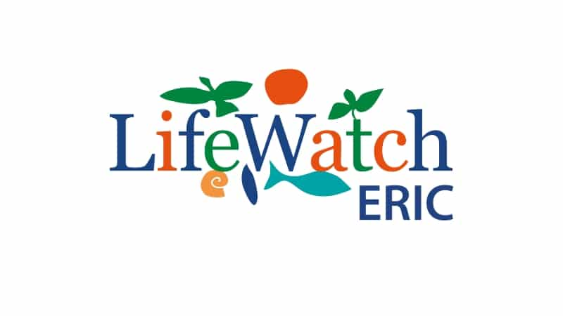

# Earth Data community

## Earth System Research Software & Tools

*Research softwares, tools, and documentations for the full Earth System — atmosphere, ocean, land, ice, and biosphere — accessible across platforms and aligned with FAIR principles.*
 
**Objective**: Federate Earth System research softwares, tools, and documentations across Europe, ensuring interoperability between platforms and communities.

---

## 🌍 About Us

The Earth Data Community brings together researchers, research infrastructures, and software developers working across Earth System Science.
This initiative aims to:

- **Federate Earth System tools and catalogs**.
- **Improve interoperability** of research software across Virtual Research Environments (VREs), platforms and research infrastructures.
- **Create a governance** for tool repositories, reviews, and merges.
- **Develop european collaborations** to foster cross-domain work across scientific environmental related disciplines and research infractures.
- **Share practices** for Research Software development, sustainability, citation, and reuse.
- **And more along the way** — shaped by the community as this initiative grows.

---

## 💬 Where to find us

### For Galaxy questions
Join us on Matrix: [#galaxyproject_earth-climate-ecology-sciences:matrix.org](https://matrix.to/#/#galaxyproject_earth-climate-ecology-sciences:matrix.org)

Together, we help users and developers with questions, ideas, and challenges around modeling, data, processes, software engineering, and cross-disciplinary topics.

---

## 🤝 How to Contribute

1. **Join the discussion** — open an issue in the [earth-data-community](https://github.com/earth-data-community) repository.
2. **Propose tools** — submit a PR to add your software to the catalog, following our metadata and quality guidelines.
3. **Review & merge** — follow the governance guidelines (TBD).
4. **Share best practices** — contribute to our guides on research software sustainability, citation, packaging, testing, and reproducibility.

### For Galaxy questions
1. **Reach out** — join the Galaxy [Matrix room](https://matrix.to/#/#galaxyproject_earth-climate-ecology-sciences:matrix.org).

---

## Vision

> *"A federated, interoperable ecosystem for Earth System Software & tools, accessible across platforms and aligned with FAIR principles."*

---

## 🙏 Acknowledgments

This initiative builds on the work of communities and research infrastructures, that have championed open science and sustainable research software in environmental sciences. We are grateful for their leadership and ongoing collaboration.

In particular, we recognize:

- **[Data Terra](https://www.data-terra.org/)** research infrastructure — for its work in earth system data, open science, and dynamic communities accros it's five thematic hubs (Odatis, Pndb, Theia, Formater, and Aeris).
- **[LifeWatch ERIC](https://www.lifewatch.eu/)** — the European e-Science infrastructure for biodiversity and ecosystem research, providing virtual labs, services, and a thriving community across the biodiversity domain.

Their expertise in **data interoperability**, **FAIR principles**, **community-driven research**, and **research software sustainability** has been instrumental in shaping this initiative — and remains central to its future.

---

### Supported by

